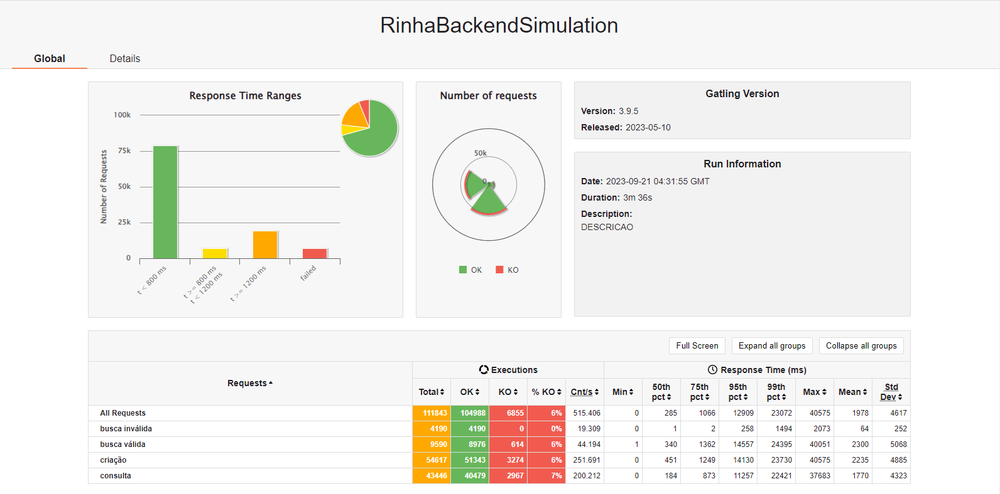

# Golang API + Postgres

| GitHub | Twitter |
| ------ | --------- |
| [`@brenoandrade`](https://github.com/brenoandrade) | [`@brenoandrader`](https://twitter.com/brenoandrader) |

## Result of test stress: 43515 registers created

## Stack

- Go 1.20
- Echo v4
- NginX
- Postgres
